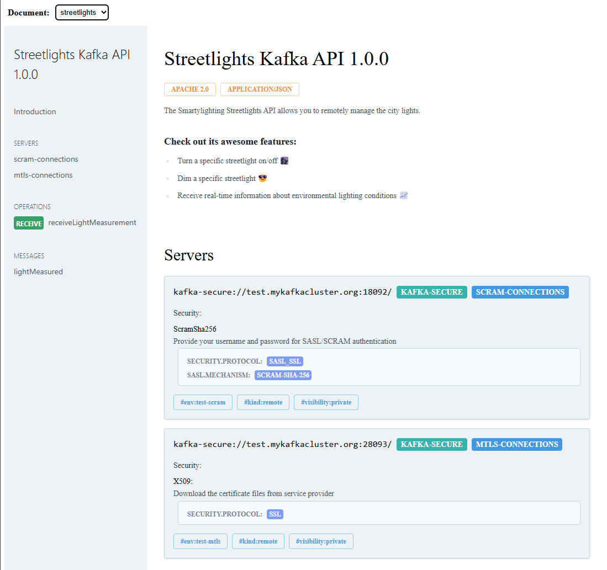

# FridaysForks.AsyncApi

Generate and serve [AsyncAPI 3.0](https://www.asyncapi.com/docs/reference/specification/v3.0.0) documentation in your ASP.NET Core application — similar to how Swagger/Swashbuckle works for REST APIs.

✅ Supports custom bindings (Kafka, AMQP, etc.)  
✅ Supports multiple AsyncAPI documents  
✅ Ships with built-in UI powered by [asyncapi-react](https://github.com/asyncapi/asyncapi-react)


---

## 🚀 Features

- Define AsyncAPI documents using C# POCO classes
- Serialize to JSON or YAML
- Serve specification documents over HTTP
- Visualize AsyncAPI specs in a browser with a customizable UI
- Register and expose multiple AsyncAPI specs

---

## 🧠 Usage

### Step 1: Provide your own implementation `IAsyncApiDocumentProvider` that is responsible for creating the AsyncAPI documents.

### Step 2: Register AsyncApi services and middleware in your `Program.cs` file.


```csharp
var builder = WebApplication.CreateBuilder(args);

builder.Services.AddAsyncApiServices();

var app = builder.Build();
app.UseAsyncApi();
```

---

## 🌐 Endpoints

- `GET /asyncapi` – UI rendering of the document using standalone version of `@asyncapi/react-component`:
- `GET /asyncapi/{name}.json` – JSON version of the document
- `GET /asyncapi/{name}.yaml` – YAML version of the document
---
